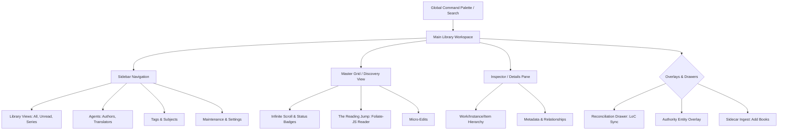

# Report: UI/UX Principles for Durable Bibliographic Management

**Date:** 2026-04-21
**Project:** Spine
**Objective:** Establish the design language for a 30-year bibliographic application, pivoting from consumer app trends to High-Utility Tool (HUT) paradigms.

## 1. The Expert Interface Paradigm
Unlike general consumer applications (e.g., Spotify, Apple Books) which optimize for casual browsing and "time on site", a bibliographic manager is a **High-Utility Tool** (HUT). Principles derived from Edward Tufte (*Envisioning Information*) and Jakob Nielsen (*Usability Engineering*) suggest that for expert users—scholars, librarians, data curators, and power readers—**data density is a feature, not a bug**, provided it is structured with a rigorous visual hierarchy.

Consumer apps hide complexity behind clicks; HUTs surface complexity through structured layout. Spine must trust its users to process dense information.

## 2. Core UX Pillars

### 2.1 The "Context Always" Principle
Users should never lose their place in the macro-library while inspecting a specific micro-element (a book, a tag, an author). 
* **Implementation:** This mandates a **Split-View / Master-Detail** pattern (Sidebar + Grid + Inspector). 
* **Anti-Pattern:** Page-based navigation (where clicking a book replaces the entire screen with the book details) destroys context. If a user is triaging 50 incoming books, they must see the queue and the current target simultaneously.

### 2.2 Information Scent & Scannability (Pirolli & Card)
Every visual element must provide a "scent" of the underlying data without requiring interaction. 
* **Implementation:** Badges, glyphs, and color accents. Indicators for "Is this a Work or an Instance?", "Is this LoC reconciled?", "Is the EPUB file physically missing?", and "Does this have a cover?" must be scannable at a glance in the grid view.
* **Anti-Pattern:** Forcing users to hover or right-click to discover state.

### 2.3 Keyboard Primacy & Command Palettes
Expert users migrate away from the mouse. Spine must support complete keyboard navigability.
* **Implementation:** A global Command Palette (e.g., `Ctrl+K` / `Cmd+K`) for executing actions ("Convert to EPUB", "Fetch LoC Metadata"). Arrow keys must navigate the grid. `Enter` must open the reader. `F2` must trigger inline rename/edit.

### 2.4 Recognition over Recall
Users should not have to remember what a field means or where an action lives. 
* **Implementation:** Consistent iconography for Agent Roles (a quill for Author, a globe for Translator) and Format Types. Action buttons stay in predictable locations across all panes.

## 3. Aesthetic: The "Scholarly Dark" Theme
To support long-session scholarship and reduce eye fatigue, Spine adopts a **Deep Navy/Slate** palette (`#020617` background) with high-contrast but low-vibrancy accents (`#38bdf8` for active states). 

* **Color Logic:** Generative, non-distracting backgrounds allow the vibrant, user-provided book covers to provide the primary visual interest.
* **Typography:** High-legibility sans-serifs (e.g., Inter or Roboto) for UI elements, paired with highly readable serifs for book descriptions and metadata long-text.

## 4. Translating Linked Data (BIBFRAME) to UI
Traditional cataloging UIs fail at BIBFRAME because they attempt to flatten a graph into a spreadsheet. Spine uses **Visual Nesting** to represent the RDF triples naturally:

### 4.1 The Work/Instance/Item Hierarchy
* **The Work** (The abstract concept, e.g., *Frankenstein 1818*) is the primary container in the UI.
* **Instances** (The specific editions, e.g., *Penguin Classics 1992*) are nested inside the Work.
* **Items** (The specific files on disk, e.g., `frankenstein_penguin.epub`) are attached to Instances.
* **UI Pattern:** An accordion or nested list within the Inspector panel. The grid primarily displays Works, with an indicator of how many Instances it contains.

### 4.2 Authority URIs as Entities, Not Strings
When a user views an Author ("Mary Shelley"), it is not a text string—it is a node (`id.loc.gov/authorities/names/n79095059`). 
* **UI Pattern:** Clicking an author doesn't just filter a search box; it opens an **Authority Entity Overlay**, showing the LoC metadata for that person, and listing all Works connected to them in the local `spine.db`.

## 5. Non-Destructive Workflows (The Reconciliation Drawer)
Because `spine.db` is an additive RDF store, fetching new data must look additive, not destructive.
* **Pattern:** The **Reconciliation Drawer** overlays the grid. It shows "Local Truth" on the left and "LoC Candidates" on the right. 
## 6. The "Liquid Glass" Visual Paradigm
Following the evolution of spatial computing and iOS 26 patterns, Spine adopts the **Liquid Glass** material system for its overlays and Drawers.
* **Layered Materiality:** The grid operates on the "Background Layer". The Reconciliation Drawer sits on a "Glass Layer" (translucent panel with 20%-80% opacity) that utilizes Lensing and Refraction. 
* **Dynamic Refraction:** As users scroll the library grid beneath the Drawer, the covers subtly blur and refract through the glass. This maintains the "Context Always" principle by keeping the entire library subliminally visible even while focused on a single book's metadata.

## 7. Explainable AI and Agentic Interaction
As Spine integrates intelligent features (like LoC Reconciliation and fuzzy-matching), it must combat user uncertainty.
* **Explainability on Demand (XAI):** Before the backend commits an official MARC record into the `spine.db` graph, the UI provides a "Rationale Badge" (the Confidence Score). 
* **Safe-to-Try Sandbox:** The Reconciliation UI acts as a sandbox. The user can see exactly how the new graph data will merge with the local data before clicking "Accept".
* **Streaming Typewriter Effect:** For any LLM-assisted metadata generation (e.g., summarizing an EPUB), the text should appear via a streaming typewriter effect. This reduces perceived latency and reinforces that the system is actively composing an answer.

## 8. Agentic Semantic Parsing and Ingestion
Spine moves beyond simple file storage towards "Agentic Ingestion."
* **Structural Parsing:** Instead of relying on fragile Calibre metadata, the system eventually will utilize multi-modal parsing to understand the semantic hierarchy of EPUBs/PDFs (headers, tables, relationships).
* **Multi-Dimensional Tagging:** Support for complex "vibes," tone, and emotional payoffs, rather than rigid genre silos, allowing the user to index their library cognitively.

## 9. Bio-Responsive Accessibility
Spine commits to "Self-Optimizing" readability standards to combat visual crowding and cognitive fatigue.
* **Variable Typography:** Implementing dynamic spacing and font weights that adapt to user preferences or reading state.
* **Dyslexia and Attentional Optimization:** Ensuring left-alignment is preserved and utilizing clear, high-contrast, scalable UI elements.

## 10. Federated Interoperability (ActivityPub / FAIR)
The long-term vision of Spine is true intellectual sovereignty.
* **ActivityPub Readiness:** Metadata structures and UI flows (like annotations and reviews) should be designed with future decentralization in mind, treating the user as an "Actor" capable of federating their knowledge to the broader Fediverse.
* **FAIR Principles:** The local `spine.db` catalog must remain Findable, Accessible, Interoperable, and Reusable, preventing "walled garden" lock-in.

---

## 11. Navigational Graph

The application architecture flows through distinct contexts, avoiding destructive page navigation in favor of panes and overlays.

---

## Appendix A — User-flow frequency ranking

User flows ranked by expected frequency, from daily/hourly to monthly maintenance. Derived from calibre usage patterns and modern bibliographic-management workflows; used as input to the Phase-1 UI scope.

### A.1 High frequency (daily / hourly)
*Must be frictionless, require zero loading spinners, and be primarily accessible via keyboard shortcuts or single clicks.*

1. **Infinite scroll (discovery)** — browsing 5,000-50,000+ books without lag. Virtualization + aggressive cover caching.
2. **Quick search** — real-time, as-you-type filter by title/author/tag.
3. **Reading jump** — one-click launch into `foliate-js` from the grid.
4. **Quick-switch (context toggle)** — "what I'm reading" vs. "what I'm cataloging."
5. **Micro-edit** — single-click inline title/author edit in grid or inspector.
6. **Sidecar ingest** — drag an EPUB or folder into the window.
7. **Status scannability** — at-a-glance answers to "on device?", "read?", "reconciled?", "missing file?".

### A.2 Medium frequency (weekly / per-batch)
*Larger screen share acceptable (drawers, overlays) and may require network calls.*

8. **Authority reconciliation (LoC fetch)** — batch "search LoC" for newly ingested books; pull MARCXML/BIBFRAME.
9. **Metadata inspector review** — map local rows to global URIs, confirm agent roles.
10. **Format projection (conversion)** — EPUB → MOBI/AZW3 for Kindle, PDF → EPUB, etc.
11. **Send to device** — MTP over USB or remote push via email/network.
12. **Work grouping (deduplication)** — multiple EPUB editions of one book grouped under a `bf:Work`.
13. **Series management** — drag-and-drop reorder within a series; define succeeds/precedes.
14. **Tag / subject curation** — rename a tag across N books; link local tag to LCSH.

### A.3 Low frequency (monthly / maintenance)
*Library health, backup, advanced config. Live in Settings or dedicated maintenance dialogs.*

15. **Library export (projection)** — project `spine.db` back to flat `metadata.db` for calibre fallback.
16. **Bulk authority sync** — background refresh of LoC data for the entire library.
17. **Database vacuum** — prune orphaned terms, optimize indices.
18. **Custom field definition** — user-defined columns mapped to custom RDF predicates.
19. **SPARQL advanced search** — complex graph queries (e.g., 19th-century French authors translated by women).
20. **Crosswalk tweaking** — modify default XSLT/SPARQL rules for MARC → Dublin Core.

### A.4 Explicitly cut from Spine
Features that defined calibre but are intentionally out of scope, to preserve architectural purity.

* **News fetching (recipes)** — RSS-to-ebook scraping. Cut: dedicated read-it-later apps handle this better.
* **Embedded Qt EPUB editor** — the "Tweak EPUB" raw HTML editor. Cut: Sigil exists and is excellent; Spine is for library management and reading, not EPUB authorship.
* **Custom Python device plugins** — Cut: standard USB MTP plus remote TCP/TLS sync covers 99% of modern devices.
